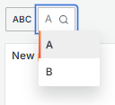

# durby-durbysceneabc-app

Grafana Scenes Plugin to demonstrate dynamic updating of the Scene.

## Grafana Dashboard can change a Custom Variable

1. Custom variable `abc` showing only 1 value, `A`.


2. Dashboard shows ABC drop-down showing only 1 value, `A`.


3. Custom variable `abc` showing 2 values, `A, B`..


4. Dashboard shows ABC drop-down showing 2 values, `A, B`.



5. Custom variable `abc` showing 2 values, `A, B, C`.


6. Dashboard shows ABC drop-down showing 2 values, `A, B, C`.


How did Grafana update a read-only custom variable and the dashboard UI component is updated to reflect the changes?

## Sample scene to dynamically update the Custom Variable abc

The `src/pages/ABCScene.tsx` creates `abc` variable with only `A` as the `query`.

```typescript
const abc = new CustomVariable({
    name: "ab",
    label: "ABC",
    query: "A"
});
```

At the bottom of `ABCScenes.tsx` are `setTimeout()` calls to add to the `abc.query`. After 10s, `B` is added. This will permit the examination of the ABC drop-down before the injection starts. Then after 2s, `C` is added.

```javascript
setTimeout(() => {
    add("B");
    setTimeout(() => {
        add("C");
    }, 2000);
}, 10000);
```

Watching the DevTools console, the injection of the next letter will be printed. After both letters have been added, the ABC drop-down will only contain `A`.


The Scene's Custom Variable shows only A at the start before the timeout starts:


After timeouts are completed:


## Grafana development

See the Grafana [README](README-Grafana.md) on how to create, build and run a Scenes plugin.
